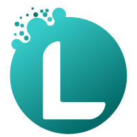

# Levge NuGet Package Coding Standards

This document defines the coding standards and practices to be followed across all Levge NuGet packages. Adhering to these standards ensures consistency, maintainability, and high quality across the Levge ecosystem.

## 1. Project Structure

### 1.1 Project File (.csproj)

- Target the latest stable .NET version (currently .NET 8.0)
- Enable nullable reference types
- Enable implicit usings
- Maintain consistent package metadata (authors, company, copyright)
- Include descriptive package tags relevant to the package's functionality
- Use semantic versioning (MAJOR.MINOR.PATCH)
- Always specify a license (preferably MIT)
- Include repository URL and package project URL

Example:<Project Sdk="Microsoft.NET.Sdk">

    <PropertyGroup>
        <TargetFramework>net8.0</TargetFramework>
        <ImplicitUsings>enable</ImplicitUsings>
        <Nullable>enable</Nullable>
        <GeneratePackageOnBuild>true</GeneratePackageOnBuild>
        <PackageId>Levge.PackageName</PackageId>
        <Version>1.0.0</Version>
        <Authors>Serdar ÖZKAN</Authors>
        <Company>Levge</Company>
        <Description>Clear and concise description of the package's purpose and features.</Description>
        <PackageTags>tag1;tag2;tag3;levge</PackageTags>
        <RepositoryUrl>https://github.com/levge-projects/Levge.PackageName</RepositoryUrl>
        <PackageProjectUrl>https://www.linkedin.com/in/serdarozkan41</PackageProjectUrl>
        <PackageLicenseExpression>MIT</PackageLicenseExpression>
        <RepositoryType>git</RepositoryType>
        <Copyright>Serdar ÖZKAN</Copyright>
    </PropertyGroup>

    <ItemGroup>
        <!-- Package references -->
    </ItemGroup>

</Project>
## 2. Code Organization

### 2.1 Namespaces

- Use `Levge.{PackageName}` as the root namespace
- Organize code into logical sub-namespaces when necessary

### 2.2 File Organization

- One class per file (except for small, related helper classes)
- Filename should match the class name
- Group related extension methods in descriptive *Extensions.cs files (e.g., `StringExtensions.cs`, `LoggerExtensions.cs`)

## 3. Code Style

### 3.1 General Guidelines

- Follow standard C# coding conventions
- Use 4 spaces for indentation
- Use blank lines to separate logical code blocks
- Keep methods short and focused on a single responsibility
- Limit line length to 120 characters

### 3.2 Naming Conventions

- Use PascalCase for class names, method names, and public properties
- Use camelCase for method parameters and local variables
- Prefix interfaces with "I" (e.g., `IMyInterface`)

### 3.3 Commenting and Documentation

- Add XML documentation to all public classes and members
- Include summary descriptions that explain the purpose, not just restate the name
- Document parameters, return values, and exceptions
- Add code comments for complex logic or non-obvious implementations

Example:/// 

/// Provides extension methods for Task objects.
/// 

public static class TaskExtensions
{
    /// 

    /// Executes a task in a fire-and-forget manner without waiting for completion.
    /// 

    /// <param name="task">The task to execute.</param>
    public static void FireAndForget(this Task task)
    {
        // Implementation
    }
}
## 4. Best Practices

### 4.1 Error Handling

- Validate method parameters with guard clauses
- Use nullable reference types properly
- Document expected exceptions in XML comments
- Consider using custom exception types for specific error cases

### 4.2 Asynchronous Programming

- Use async/await pattern consistently
- Include cancellation token support where appropriate
- Follow TAP (Task-based Asynchronous Pattern)
- Avoid blocking calls in async methods

### 4.3 Extension Methods

- Group related extension methods in dedicated static classes
- Name extension classes according to the type they extend (e.g., `StringExtensions`, `TaskExtensions`)
- Keep extension methods focused and single-purpose
- Ensure extension methods are pure when possible (no side effects)

## 5. Testing

### 5.1 Unit Tests

- Write comprehensive unit tests for all public methods
- Organize tests by class/method being tested
- Follow AAA pattern (Arrange, Act, Assert)
- Aim for high code coverage (>80%)

### 5.2 Test Naming

- Use descriptive test method names that convey:
  - The method being tested
  - The scenario/input conditions
  - The expected outcome

Example: `DeepClone_WithNestedObjects_ShouldCloneAllLevels()`

## 6. Documentation

### 6.1 README.md Structure

Each Levge package should have a standardized README.md file in both English and Turkish versions with the following structure:

#### 6.1.1 Header
- Start with the package icon (icon.png) at the top of the document
- Display the package name as the main title
- Include relevant badges underneath (build status, NuGet version, etc.)
- Provide language switcher links (e.g., "English | [Türkçe](README.tr.md)")

#### 6.1.2 Package Description
- Clear, concise description of the package's purpose
- What problems it solves and when to use it
- Key features in a bulleted list

#### 6.1.3 Installation
- NuGet package installation command:dotnet add package Levge.PackageName- Alternative installation methods if applicable

#### 6.1.4 Usage Examples
- Comprehensive code examples showing the main functionality
- Examples for different use cases or scenarios
- Comments explaining the examples where necessary

#### 6.1.5 API Documentation
- Overview of the main classes, methods, and extension methods
- Parameter descriptions and return value explanations
- Common usage patterns

#### 6.1.6 Dependencies
- List of dependent NuGet packages with versions
- Any system or framework requirements

Example README.md template:

# Levge.PackageName

English | [Türkçe](README.tr.md)

## Description

Clear and concise description of what the package does and what problems it solves.

### Features

- Feature 1
- Feature 2
- Feature 3

## Installation

Install via NuGet Package Manager:dotnet add package Levge.PackageName
## Usage// Example code showing basic usage
using Levge.PackageName;

// Sample implementation
var result = SomeClass.SomeMethod();
### Advanced Usage// More complex example
using Levge.PackageName;

// Sample implementation with more options
var options = new Options { Property = "Value" };
var result = SomeClass.SomeAdvancedMethod(options);
## API Documentation

### Class1

Description of Class1 and its purpose.

#### Methods

- `Method1(param1, param2)`: Description of what the method does.
- `Method2()`: Description of what the method does.

### Extensions

Description of extension methods provided by the package.

#### ExtensionClass1

- `ExtensionMethod1(this TargetType target)`: Description of what the extension method does.

## Dependencies

- Package1 (version)
- Package2 (version)
### 6.1.7 Example: Levge.Extensions README.md

Here's a practical example for the Levge.Extensions package:

# Levge.Extensions

English | [Türkçe](README.tr.md)

## Description

Levge.Extensions provides a collection of useful extension methods to enhance your .NET applications. It includes utilities for fire-and-forget task execution and deep object cloning.

### Features

- Fire-and-forget task execution with optional logging
- Deep object cloning via JSON serialization
- Clean API with full documentation
- Built for .NET 8.0

## Installation

Install via NuGet Package Manager:
dotnet add package Levge.Extensions
## Usage

### Fire and Forget
using Levge.Extensions;
using Microsoft.Extensions.Logging;

// Basic fire and forget
Task.Run(async () => 
{
    await SomeLongRunningOperation();
}).FireAndForget();

// With context for better error reporting
myTask.FireAndForget("BackgroundProcessing");

// With logging
ILogger logger = loggerFactory.CreateLogger<MyClass>();
myTask.FireAndForget(logger);

// With both logging and context
myTask.FireAndForget(logger, "DataImport");
### Deep Cloning
using Levge.Extensions;

// Create a deep clone of an object
var original = new MyComplexObject 
{
    Name = "Original",
    Items = new List<string> { "Item1", "Item2" }
};

var clone = original.DeepClone();
// Now clone is a completely separate copy of original
## API Documentation

### TaskExtensions

Extension methods for Task objects.

#### Methods

- `FireAndForget(this Task task)`: Executes a task in a fire-and-forget manner without waiting for completion.
- `FireAndForget(this Task task, string context)`: Executes with a context name for logging purposes.
- `FireAndForget(this Task task, ILogger logger)`: Executes with logging of any exceptions.
- `FireAndForget(this Task task, ILogger logger, string context)`: Executes with both logger and context.

### ObjectExtensions

Extension methods for object instances.

#### Methods

- `DeepClone<T>(this T obj)`: Creates a deep clone of an object using JSON serialization and deserialization.

## Dependencies

- Microsoft.Extensions.Logging.Abstractions (8.0.3)
- Levge.Exceptions (1.1.0)
And the Turkish version would follow the same format:

# Levge.Extensions

[English](README.md) | Türkçe

## Açýklama

Levge.Extensions, .NET uygulamalarýnýzý geliþtirmek için bir dizi faydalý uzantý metodu saðlar. Fire-and-forget görev yürütme ve derin nesne klonlama yardýmcý programlarýný içerir.

### Özellikler

- Ýsteðe baðlý günlükleme ile fire-and-forget görev yürütme
- JSON serileþtirme ile derin nesne klonlama
- Tam dokümantasyonlu temiz API
- .NET 8.0 için oluþturulmuþtur

## Kurulum

NuGet Paket Yöneticisi ile kurulum:
dotnet add package Levge.Extensions
## Kullaným

### Fire and Forget
using Levge.Extensions;
using Microsoft.Extensions.Logging;

// Temel fire and forget
Task.Run(async () => 
{
    await UzunSurenIslem();
}).FireAndForget();

// Daha iyi hata raporlama için baðlam ile
gorevim.FireAndForget("ArkaplanIsleme");

// Günlükleme ile
ILogger logger = loggerFactory.CreateLogger<Sinifim>();
gorevim.FireAndForget(logger);

// Hem günlükleme hem de baðlam ile
gorevim.FireAndForget(logger, "VeriIceriAktarimi");
### Derin Klonlama
using Levge.Extensions;

// Bir nesnenin derin bir klonunu oluþturma
var orijinal = new KarmasikNesnem 
{
    Ad = "Orijinal",
    Ogenler = new List<string> { "Oge1", "Oge2" }
};

var klon = orijinal.DeepClone();
// Artýk klon, orijinalin tamamen ayrý bir kopyasýdýr
## API Dokümantasyonu

### TaskExtensions

Task nesneleri için uzantý metodlarý.

#### Metodlar

- `FireAndForget(this Task task)`: Bir görevi, tamamlanmasýný beklemeden fire-and-forget þeklinde yürütür.
- `FireAndForget(this Task task, string context)`: Günlük tutma amaçlý bir baðlam adýyla yürütür.
- `FireAndForget(this Task task, ILogger logger)`: Herhangi bir istisnanýn günlüklenmesi ile yürütür.
- `FireAndForget(this Task task, ILogger logger, string context)`: Hem günlükleyici hem de baðlam ile yürütür.

### ObjectExtensions

Nesne örnekleri için uzantý metodlarý.

#### Metodlar

- `DeepClone<T>(this T obj)`: JSON serileþtirme ve deserileþtirme kullanarak bir nesnenin derin bir klonunu oluþturur.

## Baðýmlýlýklar

- Microsoft.Extensions.Logging.Abstractions (8.0.3)
- Levge.Exceptions (1.1.0)

### 6.2 Change Log

- Maintain a CHANGELOG.md file
- Document all notable changes for each version
- Group changes by type (Added, Changed, Deprecated, Removed, Fixed, Security)

### 6.3 Bilingual Documentation Considerations

When providing documentation in multiple languages (English and Turkish), follow these guidelines:

#### 6.3.1 File Naming

- Use `README.md` for the English version
- Use `README.tr.md` for the Turkish version

#### 6.3.2 Content Consistency

- Ensure that both language versions contain the same information
- Keep both versions in sync when making updates
- Maintain the same structure and organization across language versions

#### 6.3.3 Translation Quality

- Use proper technical terminology in both languages
- Avoid literal translations that might lose technical meaning
- Consider the cultural context in code examples (variable names, comments)

#### 6.3.4 Language Switcher

- Always include a language switcher at the top of the document
- Format:
  - In English version: `English | [Türkçe](README.tr.md)`
  - In Turkish version: `[English](README.md) | Türkçe`

## 7. Version Control

### 7.1 Git Practices

- Use meaningful commit messages
- Follow conventional commits format: `type(scope): message`
- Keep commits focused and atomic
- Create feature branches for new features

### 7.2 GitHub Workflow

- Use pull requests for code review
- Set up GitHub Actions for CI/CD
- Automate NuGet package publishing

## 8. Packaging and Distribution

### 8.1 NuGet Guidelines

- Set appropriate package metadata
- Include XML documentation files
- Set up SourceLink for debugging
- Publish stable versions to nuget.org
- Consider using pre-release versions for beta features

---

These standards should be applied consistently across all Levge NuGet packages to maintain quality, readability, and developer experience.